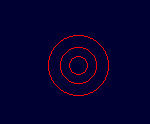

# ワークシート03: Target クラス（的）- 穴埋め問題

## 🎯 このワークシートの目標

このワークシートでは、**的クラス**を実装します。
Targetクラスは比較的シンプルですが、次のワークシート（当たり判定）の準備として重要です。

学習目標：
- クラスの継承と初期化
- シンプルなゲームオブジェクトの実装
- 描画処理の理解

---

## 🎯 的クラスの役割

1. 画面右側に固定して表示
2. 弾との当たり判定の対象になる
3. 当たったら色を変える（グレーアウト）
4. 3重の円で「的」らしく描画

---

## 📐 今回使う数学・物理

Targetクラスは**静止している**ので、複雑な物理計算はありません。

### 使う概念：
- 座標（位置）
- 半径（大きさ）
- 状態管理（当たったかどうか）

---

## 📝 問題1: Target.h のクラス定義

以下のクラス定義の【  】を埋めなさい。

```cpp
#pragma once
#include "Base.h"

class Target : public 【①】
{
public:
    Target(const Vector2D& pos, float radius, unsigned int color);
    ~Target();

    void Update() override;
    void Draw() override;

    bool IsHit() const { return 【②】; }
    void SetHit() { 【②】 = true; }
    float GetRadius() const { return 【③】; }

private:
    float 【③】;   // 的の半径
    bool 【②】;    // 当たったかどうか
};
```

**ヒント：**
- ①: 親クラスの名前
- ②: 当たったかどうかを管理するフラグ変数（英語で "is hit"）
- ③: 半径を格納する変数（英語で "radius"）

---

## 🔧 問題2: コンストラクタの実装

以下のコンストラクタの【  】を埋めなさい。

```cpp
Target::Target(const Vector2D& pos, float radius, unsigned int color)
    : 【④】(pos, { 0.0f, 0.0f }, color)  // 親クラス初期化
    , radius_(【⑤】)
    , isHit_(【⑥】)                      // 最初は当たっていない
{
    objType = OBJ_TYPE::【⑦】;
}
```

**ヒント：**
- ④: 親クラスのコンストラクタ名
- ⑤: 引数で受け取った半径の変数名
- ⑥: 最初は当たっているか？当たっていないか？（true / false）
- ⑦: 的を表すオブジェクトタイプ

**考えてみよう：**
- なぜ速度を `{ 0.0f, 0.0f }` で初期化しているのですか？
- 的は動きますか？動きませんか？

---

## 🔄 問題3: Update() の実装

Targetクラスの `Update()` 関数を完成させなさい。

```cpp
void Target::Update()
{
    // 【⑧ここに処理を書く】
}
```

**ヒント：**
- 今回の課題では、的は**固定されている**（動かない）
- 動かないオブジェクトの `Update()` には何を書けばよいでしょうか？

**考えてみよう：**
- なぜ `Update()` 関数が必要なのでしょうか？
- 何も処理がなくても関数を定義する理由は？

**答えのヒント：**
- Baseクラスで `virtual void Update() = 0;` と定義されている
- 純粋仮想関数なので、派生クラスで必ず実装が必要
- 処理が何もなくてもよい（コメントを書くだけでもOK）

---

## 🎨 問題4: Draw() の実装（提供済み）

以下の `Draw()` 関数は**すでに完成しています**。
3重の円で的を描画する処理が実装されているので、そのまま使用してください。

```cpp
void Target::Draw()
{
    Vector2D screenPos = Math2D::World2Screen(pos_);

    // 当たったら色を変える（グレーアウト）
    unsigned int drawColor = isHit_ ? GetColor(100, 100, 100) : Color_;
    
    // 3重の円で的を表現（外側から順に描画）
    DrawCircle((int)screenPos.x, (int)screenPos.y, 
               (int)radius_, drawColor, FALSE);  // 外円（枠のみ）
    DrawCircle((int)screenPos.x, (int)screenPos.y, 
               (int)(radius_ * 0.6f), drawColor, FALSE);  // 中円
    DrawCircle((int)screenPos.x, (int)screenPos.y, 
               (int)(radius_ * 0.3f), drawColor, FALSE);  // 内円
}
```

**コードの理解：**

1. **座標変換：**
   ```cpp
   Vector2D screenPos = Math2D::World2Screen(pos_);
   ```
   - ワールド座標を画面座標に変換

2. **色の切り替え：**
   ```cpp
   unsigned int drawColor = isHit_ ? GetColor(100, 100, 100) : Color_;
   ```
   - 三項演算子を使った条件分岐
   - 当たっていれば灰色、そうでなければ元の色

3. **3重の円：**
   - 外円: 半径 100%（`radius_`）
   - 中円: 半径 60%（`radius_ * 0.6f`）
   - 内円: 半径 30%（`radius_ * 0.3f`）
   - すべて `FALSE`（枠のみ）

---

## 🤔 考察問題

実装が完了したら、以下の問いに答えなさい。

### Q1: 静止オブジェクトの Update()
Targetクラスの `Update()` は何も処理をしていません。
それでもこの関数を定義する必要があるのはなぜですか？

### Q2: 三項演算子
`Draw()` 関数で使われている三項演算子：
```cpp
unsigned int drawColor = isHit_ ? GetColor(100, 100, 100) : Color_;
```
これを `if-else` 文で書き直すとどうなりますか？

### Q3: 3重の円の計算
半径が 30 の的を描画するとき、3つの円の半径はそれぞれ何ピクセルになりますか？

### Q4: 発展課題
もし的を左右に動かしたい場合、`Update()` にどのような処理を追加すればよいですか？
（実装は不要、考え方だけ答えてください）

---

## 🎯 的の描画イメージ

### 通常時（当たっていない）




### ヒット時（当たった後）


---

## ✅ 完成チェックリスト

実装が終わったら、以下を確認してください：

- [ ] コンパイルエラーがない
- [ ] 的が画面右側に表示される
- [ ] 3重の円で描画されている
- [ ] 弾が当たると色が変わる（次のワークシートで確認）
- [ ] `GetRadius()` が正しい半径を返す

---

## 👀 コードレビューのポイント

### 良いコード：
```cpp
Target::Target(const Vector2D& pos, float radius, unsigned int color)
    : Base(pos, { 0.0f, 0.0f }, color)  // 速度0で初期化（静止）
    , radius_(radius)
    , isHit_(false)
{
    objType = OBJ_TYPE::TARGET;
}
```

**ポイント：**
- 初期化リストを使っている
- 速度を明示的に0に設定
- メンバ変数の初期化順序が宣言順と一致

### 避けるべきコード：
```cpp
Target::Target(const Vector2D& pos, float radius, unsigned int color)
{
    // コンストラクタ本体で代入（非効率）
    pos_ = pos;
    radius_ = radius;
    isHit_ = false;
}
```

**問題点：**
- 初期化リストを使っていない
- 親クラスのコンストラクタを呼んでいない

---

## ➡ 次のステップ

このワークシートが完成したら、次は **WORKSHEET_04_Stage_Problem.md** に進みましょう！
最後のワークシートでは、当たり判定を実装します。

**当たり判定の数学：**
- ベクトルの減算（差ベクトル）
- ベクトルの長さ（距離）
- 円同士の衝突判定

これで砲台ゲームが完成します！🎉

---

## 📚 ナビゲーション

- [🏠 トップページに戻る](index.md)
- [⬅️ 前のワークシート: Bullet クラス（弾）](WORKSHEET_02_Bullet_Problem.md)
- [➡️ 次のワークシート: Stage クラス（当たり判定）](WORKSHEET_04_Stage_Problem.md)

---

## 🚀 発展課題（余裕があれば）

1. **的を動かす**
   ```cpp
   void Target::Update()
   {
       // 左右に往復運動
       pos_.x += speed_;
       if (pos_.x > rightLimit || pos_.x < leftLimit)
       {
           speed_ *= -1.0f; // 方向転換
       }
   }
   ```

2. **的の大きさを変える**
   - 時間経過で半径を変化させる
   - sin波で拡大縮小アニメーション

3. **複数の的**
   - 色違いの的を配置
   - 得点が異なる的を作る
